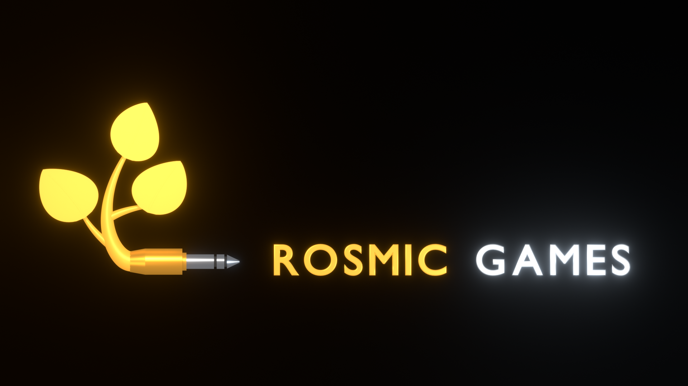

# Blend Logo Anim Creator

**Procedural animated logo intros for Blender — built from code, rendered to video in one click.**




---

## What it does

Generate a complete animated logo from a config object: extruded text, a
procedurally built icon or plant, a scripted intro, lighting and particles — then
render it straight to MP4.

Two styles ship today:

| Style | Look |
|---|---|
| **Studio Fly-in** | Extruded company text and a procedural icon fly onto a lit stage, with volumetric light shafts, smoke and floating dust. |
| **Plug & Plant** | A 3.5 mm jack streaks in from the left and seats. A cord grows out of its strain relief, branches into three leaves that unfurl as they grow (speedlapse style), the company name grows out of the plant letter by letter, and an invisible light sweeps past, lighting the metal and glowing through the text — then everything settles for a two-second hold. |

Everything is parametric and deterministic: the same config always produces the
same result, which makes iterating on a client logo predictable.

## Features

- **Two fully-scripted styles**, each with its own timing model
- **Procedural geometry** — icons (5 presets), a 3.5 mm TRS jack, branching
  stems, leaves with veins and an unroll shape key, profiled tube curves
- **Font selection** — pick any installed font, or point at a `.ttf`/`.otf`
- **FX** — volumetric shafts, animated smoke, dust, multi-coloured particle
  bursts, two-stage glow, metallic materials with a studio light rig
- **Controls** — brightness, glow, samples, resolution, frame count, settle
  hold, accent/secondary colours, and per-style toggles
- **Draft render** — 50% resolution with heavy FX hidden, settings restored
  afterwards
- **Blender 4.2 LTS → 5.x** compatible, Eevee by default (Cycles optional)

## Requirements

- Blender **4.2 LTS** or newer (tested on 4.4, 5.0, 5.1, 5.2)
- A GPU capable of running Eevee (the default engine)

## Installation

### From a release zip (recommended)

1. Download `blend_logo_anim_creator-v*.zip` from
   [Releases](../../releases).
2. In Blender: **Edit → Preferences → Add-ons → Install from Disk…**
3. Enable **Blend Logo Anim Creator**.

<details>
<summary>Installing as a Blender extension instead</summary>

The zip is laid out as a Blender extension
(`blend_logo_anim_creator/blender_manifest.toml`), so it can also be installed
through **Preferences → Extensions → Install from Disk…**.

</details>

### From source

```bat
git clone https://github.com/plastdrake/blend-logo-anim-creator.git
cd blend-logo-anim-creator
python tools/deploy.py
```

`tools/deploy.py` runs the manifest validator, the headless smoke tests, builds
the zip, installs into every detected Blender version and verifies the installed
copy. Then open Blender and enable the add-on once.

## Quick start

1. Open the 3D Viewport and press `N` to show the sidebar.
2. Open the **Logo Anim** tab.
3. Set the company name, pick a **Style**, and choose an output path.
4. **Create Animated Logo** → **Render Still** (preview) → **Draft Render**
   (fast) → **Render to Video**.

The panel exposes the same parameters as the code API:

| Setting | Purpose |
|---|---|
| Company | The name to animate |
| Font / Custom font | Typeface (system fonts, or any `.ttf`/`.otf`) |
| Style | `STUDIO` or `PLUG` |
| Icon | Studio icon preset |
| Accent / Secondary | Glow colour and second-word colour |
| Engine | Eevee (fast) or Cycles |
| Resolution / Samples | Output size and Eevee quality |
| Brightness / Glow | Exposure multiplier and bloom strength |
| Frames / Settle hold | Total length and still-logo tail |
| Output | Target `.mp4` path |
| FX toggles | Volume, smoke, dust, metallic shine, light sweep, glow |

## Programmatic usage

```python
from blend_logo_anim_creator import output
from blend_logo_anim_creator.config import LogoAnimConfig
from blend_logo_anim_creator.director import LogoDirector

cfg = LogoAnimConfig(
    company_name="ROSMIC GAMES",
    style="PLUG",                 # or "STUDIO"
    output="//logo.mp4",
    res_x=1920, res_y=1080, fps=30, frame_end=300,
    hold_seconds=2.0,             # settled logo at the end
    font="C:/Windows/Fonts/ARLRDBD.TTF",   # "" = Blender's font
    accent_color=(1.0, 0.45, 0.05, 1.0),
)

LogoDirector().build(cfg)

output.configure_video_output(bpy.context.scene, cfg.output)
output.render_animation()
```

A runnable example lives in [`examples/make_logo.py`](examples/make_logo.py):

```bat
blender --background --python examples/make_logo.py
```

See [`docs/ARCHITECTURE.md`](docs/ARCHITECTURE.md) for the module map and the
extension points for adding styles, icons and effects.

## Output and performance

Eevee, all FX on (measured on a mid-range desktop GPU):

| Resolution | Per frame | 10 s render (300 frames) |
|---|---|---|
| 1280×720 | ~2.5 s | ~12 min |
| 1920×1080 | ~4–7 s | ~20–35 min |

The MP4 only appears once the final frame is written. Use **Draft Render** for
quick iteration and **Render Still** to check a single frame.

## Development

```bat
python tools/check_manifest.py     :: manifest schema, no Blender needed
python tools/deploy.py             :: clean + validate + test + package + install
python tools/deploy.py --test      :: headless smoke tests only
python tools/deploy.py --package   :: build dist/*.zip only
python tools/publish.py            :: fill in repo URLs, create the GitHub repo, push
```

The smoke tests assert the structural invariants that have actually broken
before (cord/joint alignment, leaves in front of vines, object-instanced
particles, configured glare nodes, branch tips covered by leaves) — see
[`docs/ARCHITECTURE.md`](docs/ARCHITECTURE.md#testing).

GitHub Actions runs the Blender-free checks (byte-compile and manifest
validation) on every push; the full suite needs Blender and a GPU, so it runs
locally.

## License

Released under the **[PolyForm Perimeter License 1.0.1](LICENSE)**.

> Required Notice: Copyright 2026 Sebastian Svensson

**In plain terms:**

- ✅ **Use it for anything** — personal projects, study, hobby work, and
  **paid commercial work** such as making logos for clients.
- ✅ **Modify it** and share your changes, as long as the license comes with them.
- ❌ **Don't sell the add-on**, and don't ship a competing product built from it
  (including as a service, a port to another platform, or even for free).

The formal wording: *"Any purpose is a permitted purpose, except for providing
to others any product that competes with the software."*

> Two caveats worth knowing. This is a *source-available* license, not an
> open-source one — so it can't be published on Blender's official extensions
> platform (`extensions.blender.org`), which requires a free/libre license. And
> GitHub will label it "Other" in the sidebar, because PolyForm isn't among the
> licences GitHub auto-detects. If either matters more than blocking resale,
> switching to `SPDX:GPL-3.0-or-later` is a one-line change in
> `blender_manifest.toml`. I'm not a lawyer — if this is load-bearing for you,
> have it reviewed.

## Credits

Built by Sebastian Svensson. Icon, plug and plant geometry are generated
entirely in code — no external assets.
